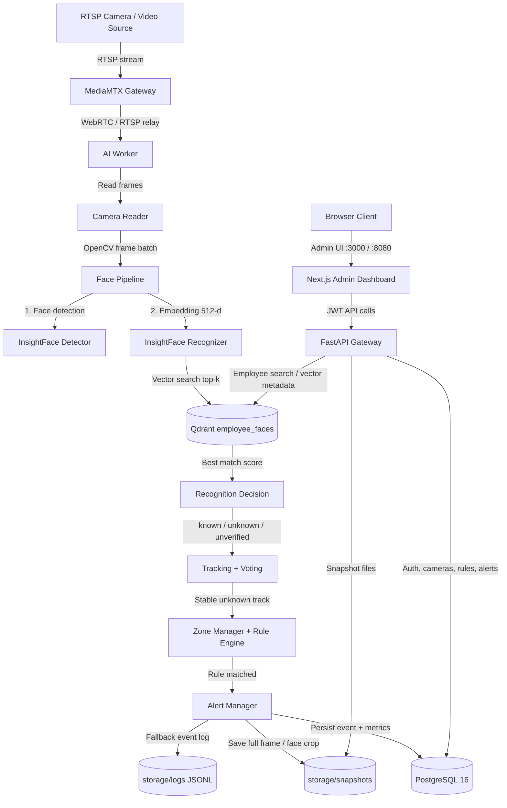

<div align="center">

# Anonymous Detection & Recognition

**AI-powered RTSP camera monitoring, face recognition, unknown-person detection, and security alert platform.**


[Overview](#overview) · [System Flow](#system-flow) · [Quick Start](#quick-start) · [Pipelines](#application-pipelines) · [Repository Map](#repository-map) · [Docs](#docs-index)

</div>

---

## Overview

Anonymous Detection & Recognition is a production-base security monitoring system for detecting and recognizing people from RTSP cameras. It uses InsightFace locally for face detection and 512-dimensional embedding extraction, Qdrant for vector similarity search, PostgreSQL for users/cameras/rules/events, FastAPI for the backend gateway, and Next.js for the admin dashboard.

| Component | Tech Stack | Current State |
|---|---|---|
| **Backend API** | FastAPI + PyJWT + psycopg | Implemented: JWT auth, health checks, alerts, cameras, rules, employees, snapshot/static serving |
| **Frontend UI** | Next.js 14 + React 18 + TypeScript | Implemented: login, admin shell, dashboard metrics, live monitor, alerts, cameras, rules, employees |
| **AI Worker** | InsightFace + ONNX Runtime + OpenCV | Implemented: RTSP frame reader, face detection, embedding extraction, recognition decision, tracking, rule engine |
| **Vector Search** | Qdrant | Implemented: `employee_faces` collection, 512-d vectors, cosine similarity, top-k matching |
| **Data Layer** | PostgreSQL 16 + local storage | Implemented: accounts, employees, cameras, alert rules, unknown events, metrics, snapshots, JSONL fallback |
| **Infrastructure** | Docker Compose + MediaMTX | Implemented: local development stack, production compose, WebRTC/RTSP gateway, startup/stop scripts, CI validation |

---

## System Flow



---

## Quick Start

All commands should be executed from the repository root.

### 1. Centralized Environment Configuration

Create a local environment file from the committed safe template:

```bash
cp .env.example .env
```

On Windows PowerShell:

```powershell
Copy-Item .env.example .env
```

Before running with real cameras, update at least:

```text
POSTGRES_PASSWORD
JWT_SECRET
CAMERA_*_RTSP
FACE_THRESHOLD
DEFAULT_AI_INTERVAL
UNKNOWN_ALERT_COOLDOWN_SECONDS
```

### 2. Startup Development Stack

Start Postgres, Qdrant, MediaMTX, initialize schema, verify databases, then launch backend and frontend:

```bash
./start.sh
```

Default local URLs:

```text
Frontend:        http://localhost:3000
Backend Health:  http://localhost:8000/system/health
Qdrant HTTP:     http://localhost:7002
MediaMTX WHEP:   http://localhost:8889
```

### 3. Run AI Worker

Run all active cameras from the database:

```powershell
python scripts/cameras/run_worker.py
```

Run one configured camera:

```powershell
python scripts/cameras/run_worker.py --camera-id door_67b
```

Run directly from one RTSP URL:

```powershell
python ai_worker/run_rtsp.py --camera-id door_67b --source "rtsp://user:password@ip:554/Streaming/Channels/101"
```

### 4. Stop Development Stack

```bash
./stop.sh
```

---

## Manual Start (Local Development)

Use this when starting each service manually instead of using `start.sh`.

### 1. Start Infrastructure Stack

```bash
docker compose -f infra/docker-compose.yml up -d
```

### 2. Initialize and Verify Databases

```powershell
python scripts/db/init_event_schema.py
python scripts/db/verify_databases.py
```

Optional import from exported data:

```powershell
python scripts/db/import_postgres_export.py
python scripts/db/import_qdrant_export.py
```

### 3. Start Backend API Gateway

```powershell
python -m pip install --upgrade pip
python -m pip install -r requirements.txt
python -m uvicorn backend.main:app --host 0.0.0.0 --port 8000
```

* API Health: `http://localhost:8000/system/health`
* API Root: `http://localhost:8000/`

### 4. Start Frontend Dashboard

```powershell
npm ci --prefix frontend
npm run dev --prefix frontend
```

* Development URL: `http://localhost:3000`

### 5. Start AI Camera Worker

```powershell
python scripts/cameras/run_worker.py
```

---

## Production Start

Validate production environment first:

```bash
python scripts/dev/validate_production_env.py
```

Build and start the full production stack:

```bash
./start-production.sh
```

Default production URLs:

```text
Frontend: http://localhost:8080
Backend:  http://localhost:8000
```

Stop production stack:

```bash
./stop-production.sh
```

---

## Application Pipelines

### Unknown-Person Detection Pipeline

| Step | Component | Action |
|---:|---|---|
| 1 | Camera / MediaMTX | Receives RTSP source and exposes WebRTC/RTSP relay |
| 2 | `ai_worker` | Reads frames using OpenCV/camera reader |
| 3 | InsightFace Detector | Detects faces and filters by score/face size |
| 4 | InsightFace Recognizer | Extracts normalized 512-d face embedding |
| 5 | Qdrant | Searches `employee_faces` collection using cosine similarity |
| 6 | Recognition Decision | Classifies face as `known`, `unknown`, or `unverified` |
| 7 | Tracker + Voting | Stabilizes decisions across multiple frames and track IDs |
| 8 | Rule Engine | Applies working-hour, restricted-zone, gate, and cooldown rules |
| 9 | Alert Manager | Saves snapshots, writes `unknown_events`, metrics, and JSONL fallback |
| 10 | Admin UI | Displays dashboard metrics, live monitor, alerts, and event details |

### Authentication & Admin Pipeline

| Step | Component | Action |
|---:|---|---|
| 1 | Browser UI | User logs in through Next.js admin dashboard |
| 2 | Backend Gateway | Validates credentials and issues JWT |
| 3 | Frontend API Client | Sends JWT with protected API requests |
| 4 | FastAPI Routers | Serves alerts, cameras, rules, employees, system health, and metrics |
| 5 | PostgreSQL | Persists accounts, camera sources, rules, unknown events, audit logs, and metrics |
| 6 | Qdrant | Stores employee face vectors and metadata for recognition |

---

## Deployment Profiles

| Profile | Cwd / Entry point | Description | Ports (Host) |
|---|---|---|---|
| **Frontend Admin** | `frontend/` | Next.js admin dashboard for monitoring and operations | Dev `3000`, Prod `8080` |
| **Backend Gateway** | `backend/` | FastAPI API for auth, system health, alerts, cameras, rules, employees | `8000` |
| **AI Worker** | `ai_worker/` | RTSP camera processing, recognition, tracking, rule evaluation, alert creation | Internal / process |
| **PostgreSQL** | `infra/docker-compose*.yml` | Relational data store for users, cameras, rules, events, metrics | `7001` |
| **Qdrant** | `infra/docker-compose*.yml` | Vector database for employee face embeddings | HTTP `7002`, gRPC `7003` |
| **MediaMTX** | `infra/mediamtx.yml` | RTSP/WebRTC gateway for camera streams | `8889` |
| **Runtime Storage** | `storage/` | Snapshots, debug faces, logs, JSONL fallback files | Local filesystem |

---

## Repository Map

```text
.
├── .github/workflows/              GitHub Actions CI workflow
├── ai_worker/                      AI pipeline, RTSP worker, tracking, rules, alerts
│   ├── face_pipeline.py            Detection + recognition pipeline
│   ├── insightface_detector.py     InsightFace face detector wrapper
│   ├── insightface_recognizer.py   InsightFace embedding extractor
│   ├── qdrant_service.py           Vector search service
│   ├── postgres_event_service.py   Unknown event persistence
│   ├── rule_engine.py              Alert rule evaluation
│   ├── camera_worker.py            Camera processing loop
│   └── run_rtsp.py                 Direct RTSP worker entry point
│
├── backend/                        FastAPI backend gateway
│   ├── auth/                       JWT login and current-user endpoints
│   ├── alerts/                     Unknown event APIs
│   ├── cameras/                    Camera source and annotated stream APIs
│   ├── employees/                  Employee list APIs
│   ├── rules/                      Alert rule APIs
│   ├── system/                     Health and metrics APIs
│   └── main.py                     FastAPI application entry point
│
├── core/                           Shared settings loader
├── data/exports/                   Optional local export/import files
├── docs/                           Setup, architecture, model, operations, deployment, CI/CD docs
├── frontend/                       Next.js admin UI
│   ├── src/app/                    App Router pages
│   ├── src/components/             Dashboard, monitor, alerts, cameras, rules, employees UI
│   └── src/lib/                    API client, auth helpers, types, config
│
├── infra/                          Docker Compose and MediaMTX config
│   ├── docker-compose.yml          Local infrastructure stack
│   ├── docker-compose.production.yml
│   └── mediamtx.yml
│
├── plan/                           Project roadmap and implementation plan
├── reports/                        Handover, pipeline, architecture, benchmark and user docs
├── scripts/                        Database, camera, benchmark, and dev utility scripts
├── storage/                        Runtime snapshots, logs, debug faces
├── .env.example                    Safe environment template
├── requirements.txt                Python dependencies
├── setup.sh                        Initial setup script
├── start.sh                        Local development launcher
├── stop.sh                         Local development stop script
├── start-production.sh             Production Compose launcher
└── stop-production.sh              Production Compose stop script
```

---

## Docs Index

Detailed design and operation documents are maintained under `docs/`, `reports/`, and `plan/`:

| Document | Purpose |
|---|---|
| [**`docs/setup.md`**](docs/setup.md) | Installation, environment preparation, and local setup |
| [**`docs/architecture.md`**](docs/architecture.md) | System architecture, service responsibilities, and deployment view |
| [**`docs/model.md`**](docs/model.md) | InsightFace, embeddings, thresholding, and recognition logic |
| [**`docs/operations.md`**](docs/operations.md) | Runtime operations, health checks, logs, and maintenance |
| [**`docs/deployment.md`**](docs/deployment.md) | Production deployment with Docker Compose |
| [**`docs/ci-cd.md`**](docs/ci-cd.md) | CI workflow and pre-push validation |
| [**`plan/plan.md`**](plan/plan.md) | Roadmap, milestones, and implementation checklist |
| [**`reports/final_report.md`**](reports/final_report.md) | Final project report and handover summary |
| [**`reports/user_guide.md`**](reports/user_guide.md) | Admin user guide |
| [**`reports/benchmark.md`**](reports/benchmark.md) | Benchmark plan and results |

---

## Service Credentials Reference

Read all sensitive values dynamically from the root `.env` file when deploying to production.

| Service | Host Port | Username | Password / Secret |
|---|---:|---|---|
| **Frontend Admin** | `3000` / `8080` | App account | Managed by backend auth |
| **Backend API** | `8000` | JWT bearer token | `JWT_SECRET` |
| **PostgreSQL DB** | `7001` | `POSTGRES_USER` | `POSTGRES_PASSWORD` |
| **Qdrant HTTP** | `7002` | — | Configure network access/security externally |
| **Qdrant gRPC** | `7003` | — | Configure network access/security externally |
| **MediaMTX WebRTC** | `8889` | Camera credentials | `CAMERA_*_RTSP` |

---

## CI/CD

The main workflow is located at `.github/workflows/ci.yml` and validates the project on push or pull request.

Current CI checks include:

| Stage | Action |
|---|---|
| Python | Install Python 3.12 dependencies from `requirements.txt` |
| Config | Create `.env` from `.env.example` for CI-safe validation |
| Compile | Compile Python source with `py_compile` |
| Backend | Import FastAPI app to catch early import/config errors |
| Frontend | Run `npm ci`, `npm run typecheck`, and `npm run build` |
| Docker | Validate `infra/docker-compose.production.yml` with `docker compose config --quiet` |

Recommended local pre-push checks:

```powershell
$files = Get-ChildItem -Recurse -Filter *.py | Where-Object { $_.FullName -notmatch '\\.venv|__pycache__' } | ForEach-Object { $_.FullName }
python -m py_compile $files
python -c "from backend.main import app; print(app.title)"
npm ci --prefix frontend
npm run typecheck --prefix frontend
npm run build --prefix frontend
docker compose --env-file .env.example -f infra/docker-compose.production.yml config --quiet
```

---

## Benchmark

Prepare dataset folders:

```text
data/benchmark/known/
data/benchmark/unknown/
data/benchmark/hard_cases/
```

Run benchmark:

```powershell
python scripts/benchmark/benchmark_pipeline.py --input data/benchmark
```

Output:

```text
reports/benchmark_results.json
reports/benchmark.md
```

---

## API Reference

```text
POST  /auth/login
GET   /auth/me
GET   /system/health
GET   /system/metrics
GET   /alerts
GET   /alerts/{event_id}
PATCH /alerts/{event_id}/status
GET   /employees
GET   /cameras
GET   /rules
PATCH /rules/{rule_code}
GET   /snapshots/{filename}
GET   /storage/*
```

---

## Architecture Accuracy Notes

- **Local AI Inference**: Face detection and embedding extraction run locally through InsightFace/ONNX Runtime; raw frames do not need to leave the deployment machine for recognition.
- **Vector-Based Identity Matching**: Employee recognition is based on 512-dimensional face embeddings in Qdrant with cosine similarity and a configurable `FACE_THRESHOLD`.
- **Noise-Resistant Alerting**: Unknown-person alerts are stabilized by face quality checks, tracking, multi-frame voting, zone/rule evaluation, and cooldown windows.
- **Runtime Data Separation**: Source code is separated from runtime artifacts. Snapshots, logs, debug faces, benchmark datasets, and exports live under `storage/`, `reports/`, or `data/` and should not contain committed production secrets.
- **Production Secret Hygiene**: Never deploy with `.env.example` defaults. Rotate `POSTGRES_PASSWORD`, generate a strong `JWT_SECRET`, and replace all placeholder camera credentials before production use.
- **Camera Calibration Required**: Final thresholds, ROI zones, working hours, and alert cooldowns should be calibrated using real camera feeds and real lighting conditions before operating in production.
