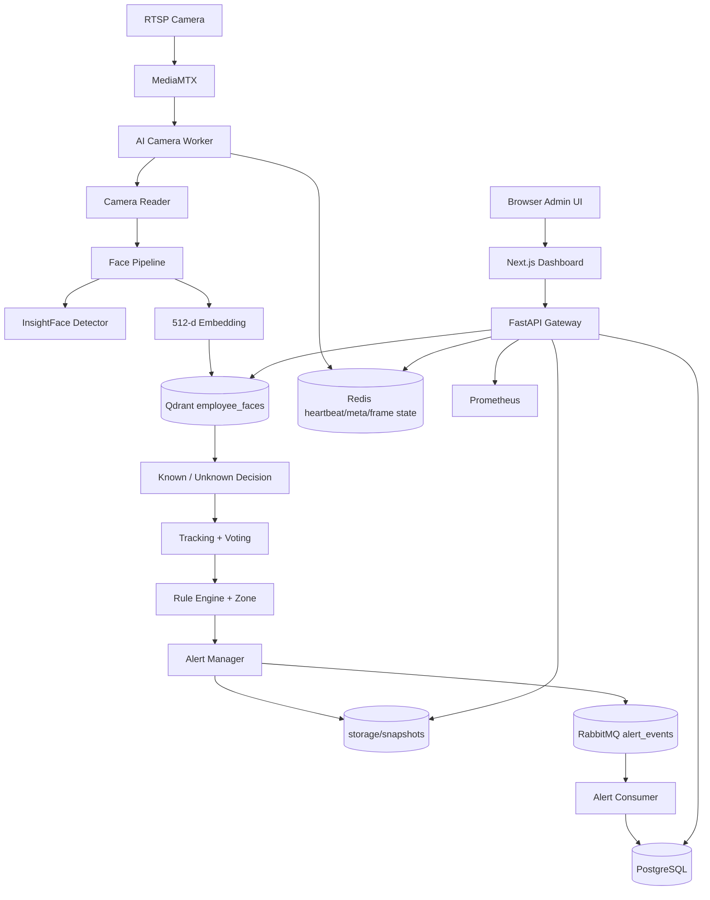

<div align="center">

# Anonymous Detection & Recognition

**Nền tảng giám sát camera RTSP, nhận diện khuôn mặt nhân viên, phát hiện người lạ và quản trị cảnh báo theo thời gian thực.**


[Tổng quan](#tổng-quan) - [Chạy nhanh](#chạy-nhanh) - [Production](#production) - [Pipeline](#pipeline) - [CI/CD](#cicd) - [Docs](#docs)

</div>

---

## Tổng Quan

Anonymous Detection & Recognition là hệ thống giám sát an ninh dùng camera RTSP để nhận diện nhân viên và phát hiện người lạ. Hệ thống dùng FastAPI làm backend gateway, Next.js làm admin dashboard, InsightFace/ONNX Runtime cho nhận diện khuôn mặt, Qdrant cho tìm kiếm vector embedding, PostgreSQL cho dữ liệu nghiệp vụ, Redis/RabbitMQ cho trạng thái realtime và event pipeline.

| Thành phần | Công nghệ | Trạng thái |
|---|---|---|
| Backend API | FastAPI, PyJWT, psycopg | JWT auth, RBAC, users CRUD, alerts, cameras, rules, employees, system health, metrics |
| Frontend Admin | Next.js 14, React 18, TypeScript | Login, dashboard, cameras, alerts, employees, rules, users, system monitoring |
| AI Worker | InsightFace, ONNX Runtime, OpenCV | Đọc RTSP, detect face, embedding 512-d, match Qdrant, tracking, rule engine |
| Vector DB | Qdrant | Collection `employee_faces`, cosine search, metadata nhân viên |
| Data Layer | PostgreSQL, local storage | Accounts, employees, cameras, rules, unknown events, snapshots, audit logs |
| Runtime State | Redis, RabbitMQ | Camera heartbeat, reload cooldown, frame/meta realtime, alert event queue |
| Streaming | MediaMTX | RTSP relay và WebRTC/WHEP endpoint |
| Observability | Prometheus, Alertmanager, Grafana | Metrics backend/infra, health checks, monitoring dashboard |
| Production | Docker Compose, Nginx | Production compose, reverse proxy, startup/stop scripts, env validation |

---

## Luồng Hệ Thống


```mermaid
flowchart TD
    Camera[RTSP Camera] --> MediaMTX[MediaMTX]
    MediaMTX --> Worker[AI Camera Worker]

    Worker --> Reader[Camera Reader]
    Reader --> FacePipeline[Face Pipeline]
    FacePipeline --> Detector[InsightFace Detector]
    FacePipeline --> Embedding[512-d Embedding]
    Embedding --> Qdrant[(Qdrant employee_faces)]

    Qdrant --> Decision[Known / Unknown Decision]
    Decision --> Tracker[Tracking + Voting]
    Tracker --> RuleEngine[Rule Engine + Zone]
    RuleEngine --> AlertManager[Alert Manager]

    AlertManager --> Storage[(storage/snapshots)]
    AlertManager --> RabbitMQ[(RabbitMQ alert_events)]
    RabbitMQ --> AlertConsumer[Alert Consumer]
    AlertConsumer --> Postgres[(PostgreSQL)]

    Worker --> Redis[(Redis heartbeat/meta/frame state)]

    Browser[Browser Admin UI] --> Frontend[Next.js Dashboard]
    Frontend --> Backend[FastAPI Gateway]
    Backend --> Postgres
    Backend --> Qdrant
    Backend --> Redis
    Backend --> Storage
    Backend --> Prometheus[Prometheus]
```

---

## Chạy Nhanh

Tất cả lệnh chạy từ thư mục root của repo.

### 1. Tạo file môi trường

```bash
cp .env.example .env
```

Trên Windows PowerShell:

```powershell
Copy-Item .env.example .env
```

Các biến nên kiểm tra trước khi chạy camera thật:

```text
POSTGRES_PASSWORD
JWT_SECRET
CAMERA_*_RTSP
FACE_THRESHOLD
DEFAULT_AI_INTERVAL
UNKNOWN_ALERT_COOLDOWN_SECONDS
```

### 2. Start development stack

Khuyến nghị dùng Git Bash trên Windows:

```bash
./start.sh
```

Script sẽ start Docker infra, bootstrap DB, init schema, verify DB, start backend, alert consumer, AI worker và frontend.

URL mặc định:

```text
Frontend local:      http://localhost:3000
Frontend LAN:        http://192.168.2.182:3000
Backend health:      http://localhost:8000/system/health
Qdrant HTTP:         http://localhost:7002
MediaMTX WHEP:       http://localhost:8889
Prometheus:          http://localhost:9090
RabbitMQ UI:         http://localhost:15672
```

### 3. Stop development stack

```bash
./stop.sh
```

---

## Production

Validate production config:

```bash
python scripts/dev/validate_production_env.py
docker compose --env-file .env.example -f infra/docker-compose.production.yml config --quiet
```

Start production stack:

```bash
./start-production.sh
```

Stop production stack:

```bash
./stop-production.sh
```

Production stack gồm Nginx, backend, frontend, AI worker, alert consumer, Postgres, Qdrant, Redis, RabbitMQ, MediaMTX, Prometheus, Alertmanager và Grafana tùy cấu hình.

---

## Pipeline

### Unknown Detection

| Bước | Component | Hành động |
|---:|---|---|
| 1 | Camera | Gửi RTSP stream |
| 2 | MediaMTX | Relay stream cho worker và web preview |
| 3 | AI Worker | Đọc frame, resize, detect face |
| 4 | InsightFace | Tạo embedding khuôn mặt |
| 5 | Qdrant | Tìm nhân viên gần nhất theo cosine similarity |
| 6 | Tracker | Gom nhiều frame để giảm false positive |
| 7 | Rule Engine | Kiểm tra zone, cooldown, severity, rule active |
| 8 | Alert Manager | Lưu snapshot và publish event |
| 9 | Alert Consumer | Ghi event bền vững vào Postgres |
| 10 | Frontend | Hiển thị alert, camera status, meta realtime |

### Auth Và RBAC

| Role | Tên | Ý nghĩa |
|---:|---|---|
| 0 | viewer | Chỉ xem |
| 1 | operator | Vận hành cơ bản |
| 5 | admin | Quản trị nghiệp vụ |
| 9 | admin_super | Toàn quyền |

Backend inject `CurrentUser` từ JWT, sau đó các router dùng permission như `users:update`, `alerts:delete`, `rules:update`, `cameras:update` để cho phép hoặc từ chối thao tác.

### Camera Reload

Reload camera có Redis cooldown để chống spam. Backend không spawn trực tiếp worker nặng trong request reload; frontend disable nút reload đến khi hết cooldown.

---

## Những Sửa Đổi Quan Trọng Gần Đây

- Frontend local dùng `NEXT_DIST_DIR=.next-rapi-local` để tránh cache `.next`/`.next-dev-local` bị kẹt quyền trên Windows.
- `start.sh` dùng `NEXT_PUBLIC_API_BASE=http://192.168.2.182:3000/api` trong LAN mode để tránh Git Bash/MSYS đổi `/api` thành `D:/Git/api`.
- InsightFace model cache mặc định nằm trong `models/insightface`. Khi chuyển máy, copy thư mục `models/` để tránh tải lại model; engine TensorRT hoặc artifact convert nên để trong `models/trt` hoặc `models/artifacts`.
- `frontend/src/lib/config.ts` normalize API base, tự fallback về `/api` nếu gặp Windows path hoặc `file:`.
- Camera reload có cooldown backend/frontend, tránh spam reload làm worker/backend bị nghẽn.
- Users CRUD audit log đã convert `datetime/date` sang ISO string trước khi ghi JSONB.
- `setup.sh` mặc định chạy frontend typecheck thay vì production build nặng.

---

## Repository Map

```text
.
├── backend/                         FastAPI backend gateway
│   ├── alerts/                      Alerts CRUD, safe delete, restore, repair
│   ├── auth/                        JWT auth, login events, RBAC security
│   ├── cameras/                     Camera config, runtime, annotated stream, reload guard
│   ├── employees/                   Employee list/search/enroll
│   ├── rules/                       Alert rule management
│   ├── system/                      Health, analytics, monitoring API
│   ├── users/                       User CRUD, role update, audit log
│   └── main.py                      FastAPI app entrypoint
├── frontend/                        Next.js admin dashboard
│   ├── src/app/                     App Router pages
│   ├── src/components/              Dashboard panels
│   ├── src/lib/                     API client, auth, config, types, permissions
│   └── next.config.js               Rewrites and local distDir support
├── ai_worker/                       Camera AI worker
├── scripts/                         DB, camera, alert, dev validation scripts
├── infra/                           Docker compose, Nginx, Prometheus, Grafana, MediaMTX
├── docs/                            Architecture, setup, deployment, operations, CI/CD
├── reports/                         Reports and benchmark results
├── storage/                         Runtime snapshots/logs/debug faces
├── .github/workflows/ci.yml         GitHub Actions CI
├── .env.example                     Safe env template
├── setup.sh                         Install/bootstrap script
├── start.sh                         Local start script
├── stop.sh                          Local stop script
├── start-production.sh              Production start script
└── stop-production.sh               Production stop script
```

---

## CI/CD

Workflow chính:

```text
.github/workflows/ci.yml
```

CI hiện kiểm tra:

1. Python 3.12 dependencies.
2. Copy `.env.example` sang `.env`.
3. Compile toàn bộ Python bằng `py_compile`.
4. Import FastAPI app.
5. Node.js 20 dependencies bằng `npm ci --prefix frontend`.
6. Frontend typecheck.
7. Frontend production build.
8. Validate production compose config.

Local checks trước khi push:

```powershell
$files = Get-ChildItem -Recurse -Filter *.py | Where-Object { $_.FullName -notmatch '\\.venv|__pycache__|\\.next|node_modules' } | ForEach-Object { $_.FullName }
python -m py_compile $files
python -c "from backend.main import app; print(app.title)"
npm ci --prefix frontend
npm run typecheck --prefix frontend
npm run build --prefix frontend
docker compose --env-file .env.example -f infra/docker-compose.production.yml config --quiet
```

---

## Checklist Push GitHub

- Không commit `.env`, token, mật khẩu, RTSP thật.
- Không commit `admin_super_login.md` nếu có thông tin đăng nhập thật.
- Không commit `.runtime/`, `.next*`, `storage/snapshots/*`, `storage/logs/*`, `test-results/`.
- Kiểm tra `.env.example` chỉ chứa placeholder an toàn.
- Chạy Python compile, frontend typecheck/build và Compose validation.
- Nếu sửa camera/worker, smoke test ít nhất một camera active.
- Nếu sửa auth/users/RBAC, test login bằng `admin_super` và update role user.

---

## Docs

| File | Nội dung |
|---|---|
| [docs/architecture.md](docs/architecture.md) | Kiến trúc backend/frontend/worker/infra |
| [docs/setup.md](docs/setup.md) | Setup local, Git Bash, frontend cache, start/stop |
| [docs/deployment.md](docs/deployment.md) | Production compose, Nginx, env validation |
| [docs/operations.md](docs/operations.md) | Vận hành camera, worker, logs, troubleshooting |
| [docs/ci-cd.md](docs/ci-cd.md) | GitHub Actions, local checks, release checklist |
| [docs/model.md](docs/model.md) | Model, embedding, threshold và nhận diện |
